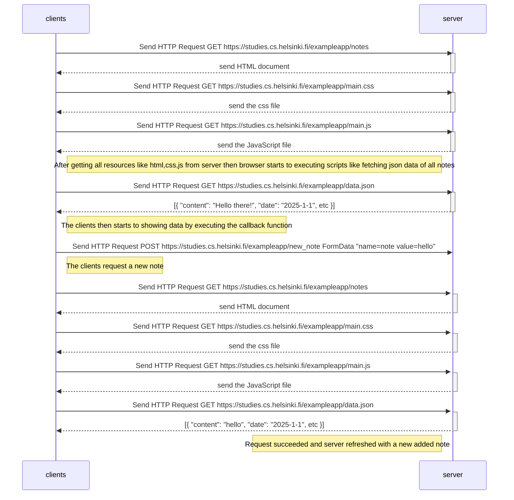

```mermaid
sequenceDiagram
participant clients
participant server

    clients->>server: Send HTTP Request GET https://studies.cs.helsinki.fi/exampleapp/notes
    activate server
    server-->>clients: send HTML document
    deactivate server

    clients->>server: Send HTTP Request GET https://studies.cs.helsinki.fi/exampleapp/main.css
    activate server
    server-->>clients: send the css file
    deactivate server

    clients->>server: Send HTTP Request GET https://studies.cs.helsinki.fi/exampleapp/main.js
    activate server
    server-->>clients: send the JavaScript file
    deactivate server

    Note right of clients: After getting all resources like html,css,js from server then browser starts to executing scripts like fetching json data of all notes

    clients->>server: Send HTTP Request GET https://studies.cs.helsinki.fi/exampleapp/data.json
    activate server
    server-->>clients: [{ "content": "Hello there!", "date": "2025-1-1", etc }]
    deactivate server

    Note right of clients: The clients then starts to showing data by executing the callback function

    clients->>server: Send HTTP Request POST https://studies.cs.helsinki.fi/exampleapp/new_note FormData "name=note value=hello"
    Note right of clients: The clients request a new note
    activate server

    clients->>server: Send HTTP Request GET https://studies.cs.helsinki.fi/exampleapp/notes
    activate server
    server-->>clients: send HTML document
    deactivate server

    clients->>server: Send HTTP Request GET https://studies.cs.helsinki.fi/exampleapp/main.css
    activate server
    server-->>clients: send the css file
    deactivate server

    clients->>server: Send HTTP Request GET https://studies.cs.helsinki.fi/exampleapp/main.js
    activate server
    server-->>clients: send the JavaScript file
    deactivate server

    clients->>server: Send HTTP Request GET https://studies.cs.helsinki.fi/exampleapp/data.json
    activate server
    server-->>clients: [{ "content": "hello", "date": "2025-1-1", etc }]
    deactivate server

    Note left of server: Request succeeded and server refreshed with a new added note
```
