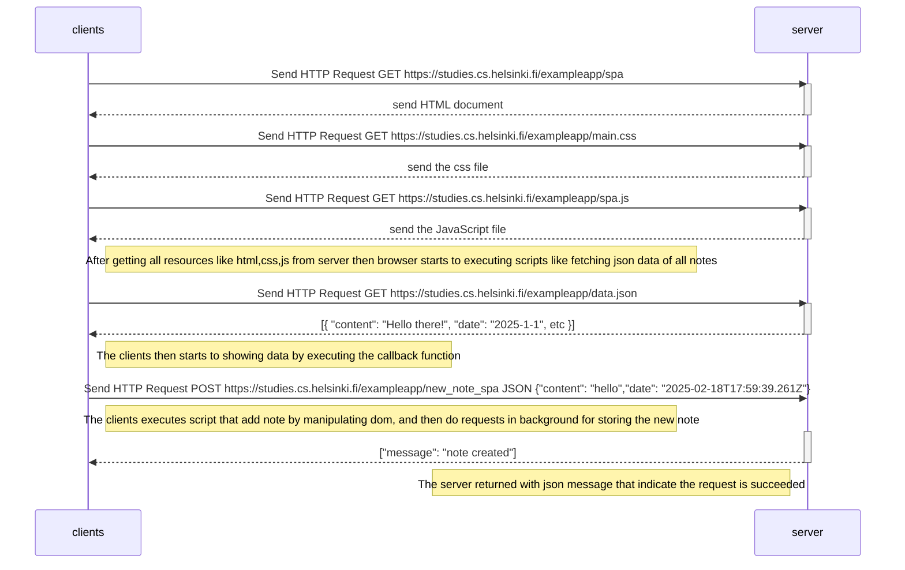

```mermaid
sequenceDiagram
participant clients
participant server

    clients->>server: Send HTTP Request GET https://studies.cs.helsinki.fi/exampleapp/spa
    activate server
    server-->>clients: send HTML document
    deactivate server

    clients->>server: Send HTTP Request GET https://studies.cs.helsinki.fi/exampleapp/main.css
    activate server
    server-->>clients: send the css file
    deactivate server

    clients->>server: Send HTTP Request GET https://studies.cs.helsinki.fi/exampleapp/spa.js
    activate server
    server-->>clients: send the JavaScript file
    deactivate server

    Note right of clients: After getting all resources like html,css,js from server then browser starts to executing scripts like fetching json data of all notes

    clients->>server: Send HTTP Request GET https://studies.cs.helsinki.fi/exampleapp/data.json
    activate server
    server-->>clients: [{ "content": "Hello there!", "date": "2025-1-1", etc }]
    deactivate server

    Note right of clients: The clients then starts to showing data by executing the callback function

    clients->>server: Send HTTP Request POST https://studies.cs.helsinki.fi/exampleapp/new_note_spa JSON {"content": "hello","date": "2025-02-18T17:59:39.261Z"}
    Note right of clients: The clients executes script that add note by manipulating dom, and then do requests in background for storing the new note
    activate server
    server-->>clients: ["message": "note created"]
    deactivate server
    Note left of server: The server returned with json message that indicate the request is succeeded

```
